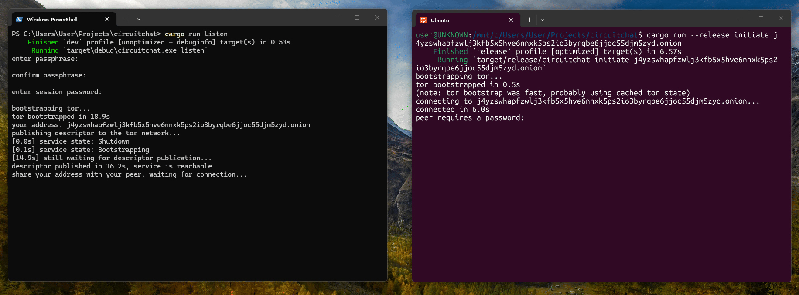

# circuitchat
P2P encrypted messaging over Tor made in Rust, with support for file transfer.

It creates ephemeral Tor onion services for real-time messaging with the [Noise Protocol Framework](https://noiseprotocol.org/). There is no server and no identity, all connections are ephemeral. It is meant to reduce metadata leakage.

## Features

- Tor-first: Uses [Arti](https://gitlab.torproject.org/tpo/core/arti) to bootstrap a Tor client and expose onion services directly from the binary. No external Tor daemon required.
- E2EE: Every session performs a full Noise_NN handshake (`Noise_NN_25519_ChaChaPoly_BLAKE2s`) over the Tor stream, so traffic is encrypted independent of Tor's own transport layer.
- Forward secrecy: The ephemeral Noise handshakes provide forward secrecy, so compromise of stored data does not expose past session messages.
- TUI: Chat interface powered by [ratatui](https://github.com/ratatui/ratatui) with scrollable message history, timestamps, and a status bar.
- Encrypted local history: Optionally persist chat messages in a local SQLite database, encrypted at rest with XChaCha20-Poly1305 (key derived from a passphrase via Argon2).
- Zero-config defaults: Works out of the box with a single command, no setup required (other than installing Rust)

## Usage
### Listen for a connection
```sh
circuitchat listen
```
The program bootstraps Tor, creates an onion service, and prints your `.onion` address. Share this address with your peer.

### Connect to a peer
```sh
circuitchat initiate <onion_address>
```
Connects to the given onion address over Tor and starts a chat session.

## Configuration
A `circuitchat.toml` file is created next to the binary on first run:

```toml
[identity]
persist = false

[history]
save = false
passphrase = ""

[time]
24h = false
local = false

[auth]
enabled = false
password = ""


```
`identity.persist`: When `true`, Tor state and cache are saved between runs so the onion address remains stable, and chat history is stored locally if history.save = true.\
`history.save`: When `true` (requires `identity.persist = true`), messages are saved to an encrypted SQLite database.\
`history.passphrase`: Hardcoded passphrase for the message database. If left empty, the passphrase is prompted interactively at startup.\
`time.24h`: When `true`, timestamps are displayed in 24-hour format.\
`time.local`: When `true`, timestamps are displayed in local time with timezone. Otherwise, UTC time is used.\
`auth.enabled`: When `true`, clients must provide a password to connect.\
`auth.password`: Hardcoded password for client authentication. If left empty, the password is prompted interactively at startup.\
## Disclaimer
The `Noise_NN` pattern provides no authentication, it protects against passive eavesdroppers but not active MITM attacks beyond what Tor itself provides. This is mitigated by allowing users to set a password for authentication.
