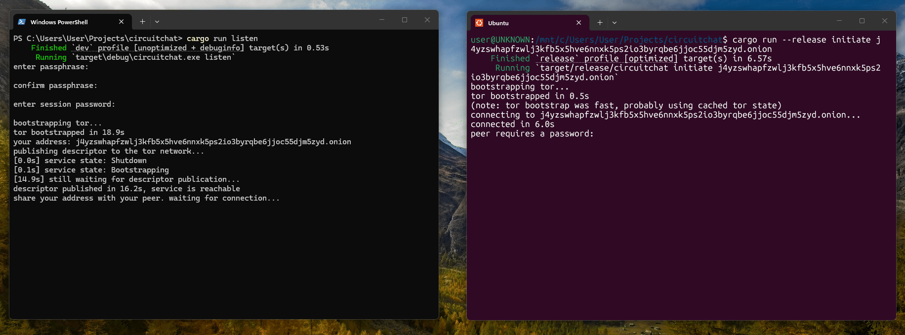

# circuitchat

P2P encrypted messaging over Tor in Rust. Creates ephemeral onion services for chat using the [Noise Protocol Framework](https://noiseprotocol.org/). There is no server and no identity, it is meant to reduce metadata leakage.

Main site: https://circuitchat.1707070.xyz
Onion: http://si52lslgxgqnzom5bsbyr7axyj6r3ykelskahuuf36dxrzrbsppio5qd.onion/



## Features
- **Tor-first** - uses [Arti](https://gitlab.torproject.org/tpo/core/arti) directly. no system Tor installation needed
- **E2EE** - every session runs a full `Noise_NN_25519_ChaChaPoly_BLAKE2s` handshake over the Tor stream
- **Forward secrecy** - ephemeral Noise keys mean past sessions cannot be decrypted even if local data is later compromised
- **Mutual auth** - optional shared password for session authentication (HMAC-SHA256 over an Argon2-derived key)
- **File transfer** - send and receive files
- **Encrypted history** - optionally persist messages in a local SQLite database encrypted per-message with XChaCha20-Poly1305
- **Bridge support** - configure Tor bridges for use in censored networks

## Quick start
To start a listener (where someone connects to you):
```sh
circuitchat listen
```
To start an initiator (where you connect to someone else):
```sh
circuitchat initiate <onion_address>
```
On first run a `circuitchat.toml` config file is created next to the binary. All generated files (`circuitchat.toml`, `circuitchat.db`, `cache/`, `state/`, `downloads/`) live in the same directory as the binary.

## Documentation
[Usage](docs/usage.md)\
[Configuration](docs/CONFIG.md) \
[Security](docs/SECURITY.md) \
[File transfer](docs/FILES.md)
